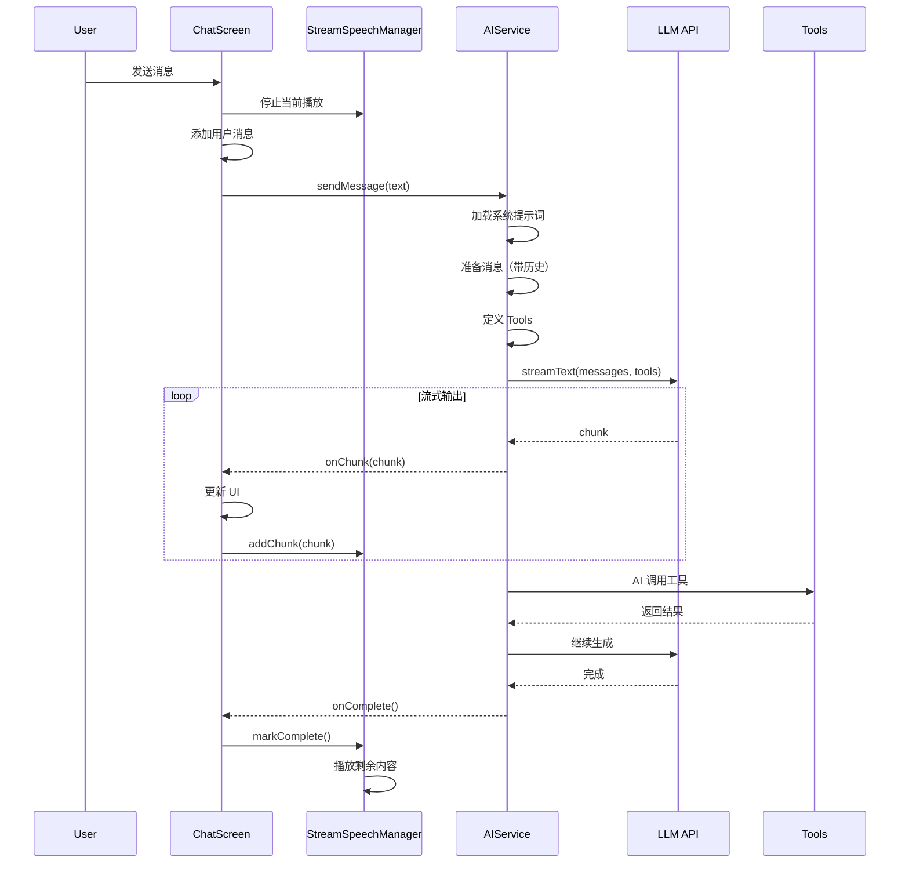
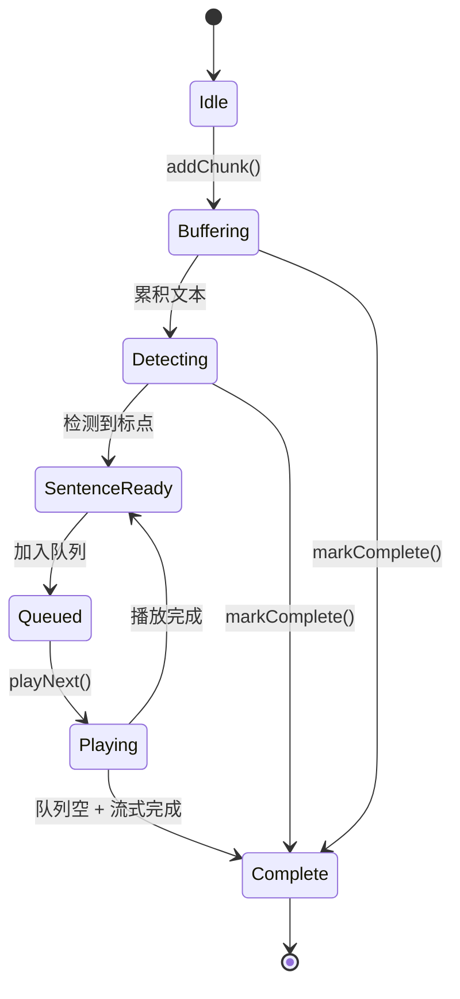
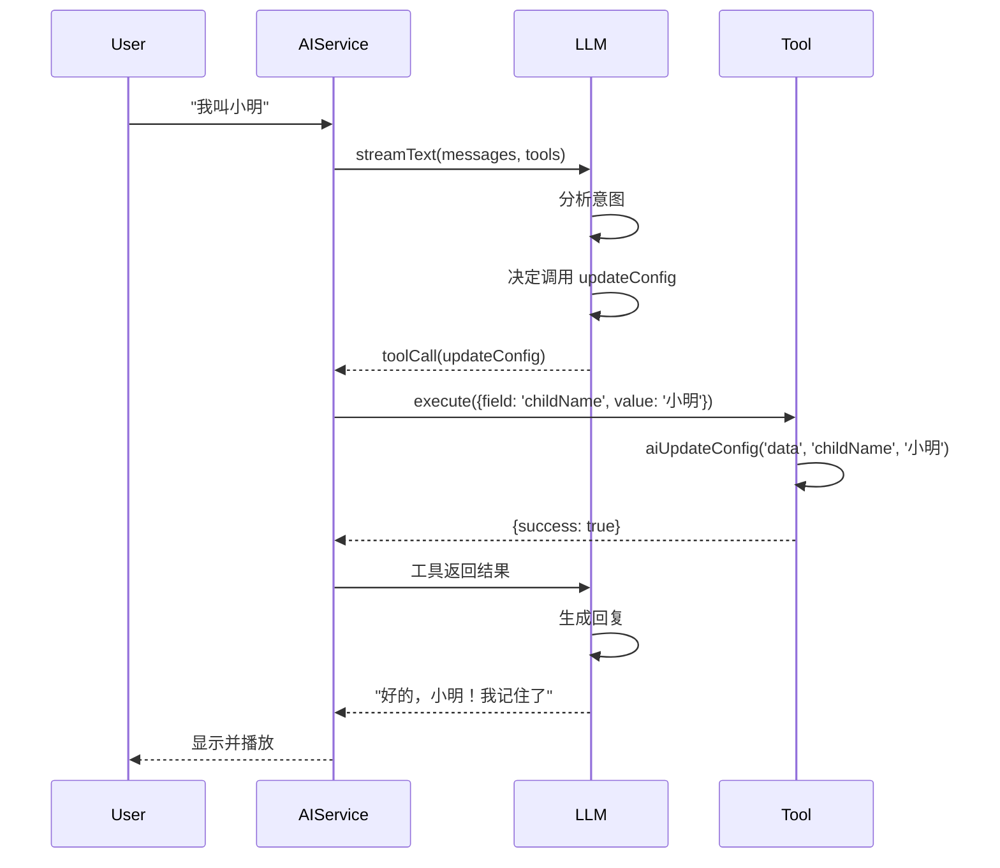

# KidCompanion v3.7 架构文档

**版本**: v3.7.0  
**最后更新**: 2026-02-23

---

## 📐 系统架构

### 整体架构

```
┌─────────────────────────────────────────────────┐
│              React Native App                   │
│                                                 │
│  ┌─────────────────────────────────────────┐   │
│  │           Presentation Layer            │   │
│  │  (ChatScreen, StoryScreen, etc.)        │   │
│  └───────────────────┬─────────────────────┘   │
│                      │                          │
│  ┌───────────────────▼─────────────────────┐   │
│  │         StreamSpeechManager             │   │
│  │  (流式语音管理 - 核心创新)               │   │
│  └───────────────────┬─────────────────────┘   │
│                      │                          │
│  ┌───────────────────▼─────────────────────┐   │
│  │            Service Layer                │   │
│  │  (AIService with Vercel AI SDK)         │   │
│  │  ┌─────────────────────────────────┐    │   │
│  │  │         Tools System            │    │   │
│  │  │  getConfig, updateConfig        │    │   │
│  │  │  webSearch, knowledge           │    │   │
│  │  └─────────────────────────────────┘    │   │
│  └───────────────────┬─────────────────────┘   │
│                      │                          │
│  ┌───────────────────▼─────────────────────┐   │
│  │            Skills System                │   │
│  │  (chat, story, science, extension)      │   │
│  └─────────────────────────────────────────┘   │
└─────────────────────────────────────────────────┘
                       │
                       ▼
            ┌──────────────────┐
            │   External APIs  │
            │  (LLM, Search)   │
            └──────────────────┘
```

---

## 🏗️ 分层架构

### 1. Presentation Layer (展示层)

**职责**: UI 渲染、用户交互

**组件**:
- ChatScreen (聊天界面)
- StoryScreen (讲故事界面)
- ScienceScreen (科普界面)
- WizardScreen (配置引导界面)

**关键特性**:
- 流式 UI 更新
- 语音播放控制
- Skills 切换 UI

---

### 2. Speech Layer (语音层)

**核心组件**: StreamSpeechManager

**职责**:
- 流式文本累积
- 智能分句检测
- 语音播放队列
- 中断处理

**工作流程**:
```
addChunk(chunk)
    ↓
累积到 buffer
    ↓
检测中文标点（。！？!?）
    ↓
分割完整句子
    ↓
加入播放队列
    ↓
顺序播放
```

---

### 3. Service Layer (服务层)

**核心组件**: AIService (基于 Vercel AI SDK)

**职责**:
- AI 模型调用
- 流式输出处理
- Tool 系统管理
- 对话历史管理

**关键方法**:
```typescript
sendMessage(
  text: string,
  options?: { context?: any },
  callbacks?: {
    onChunk?: (chunk) => void,
    onComplete?: (text) => void,
    onToolCall?: (name, args) => void
  }
)
```

---

### 4. Tools Layer (工具层)

**工具列表**:
- getConfig / updateConfig (配置管理)
- webSearch / kidsSearch (网络搜索)
- knowledge / addKnowledge (知识库)

**工具定义**:
```typescript
const tool = tool({
  description: '工具描述',
  parameters: z.object({ /* Schema */ }),
  execute: async (params) => {
    // 执行逻辑
  }
});
```

---

### 5. Skills Layer (能力层)

**Skills**:
- chatSkill (聊天)
- storySkill (讲故事)
- scienceSkill (科普)
- englishSkill (英语)
- mathSkill (数学)
- poemSkill (诗词)

**Skill 结构**:
```typescript
interface Skill {
  id: string;
  name: string;
  keywords: string[];
  systemPrompt: string;
}
```

---

## 🔄 核心流程

### 1. 用户发送消息流程



---

### 2. 流式语音播放流程



---

### 3. AI 调用 Tool 流程



---

## 📦 数据流

### 1. 配置数据流

```
WizardScreen
    ↓
生成配置信息
    ↓
configManager.saveConfig()
    ├─ Markdown 文件 (system/user/identity.md)
    └─ JSON 数据 (@kid_companion_config_data)
         ↓
    AIService.buildSystemPromptFromFiles()
         ├─ 读取 Markdown 文件
         └─ 读取 JSON 数据
              ↓
         生成系统提示词
```

---

### 2. 消息数据流

```
用户输入
    ↓
ChatScreen.handleSend()
    ↓
AIService.sendMessage()
    ├─ 加载历史消息 (@chat_message_history)
    ├─ 构建消息数组
    └─ 调用 streamText()
         ↓
    LLM API
         ↓
    流式响应
    ├─ onChunk: 更新 UI + 添加到语音队列
    └─ onComplete: 保存消息到历史
```

---

### 3. Skills 数据流

```
用户消息
    ↓
detectSkill(text)
    ├─ 检查关键词
    └─ 返回 skillId
         ↓
activateSkill(skill)
    ├─ 获取 systemPrompt
    └─ 设置状态
         ↓
AIService.sendMessage()
    ├─ 使用 Skill 的 systemPrompt
    └─ 调用 LLM
```

---

## 🔧 技术栈

### 核心框架

| 技术 | 版本 | 用途 |
|------|------|------|
| React Native | 0.74.5 | 跨平台框架 |
| Expo | ~51.0.8 | 开发平台 |
| TypeScript | ~5.3.3 | 类型安全 |

### AI 相关

| 技术 | 版本 | 用途 |
|------|------|------|
| Vercel AI SDK | latest | 流式输出 |
| @ai-sdk/openai | latest | 模型适配 |
| Zod | latest | Schema 验证 |

### 语音相关

| 技术 | 版本 | 用途 |
|------|------|------|
| @react-native-voice/voice | ^3.2.4 | 语音识别 |
| expo-speech | ~12.0.2 | 语音播放 |

### 状态管理

| 技术 | 版本 | 用途 |
|------|------|------|
| Zustand | ^4.4.1 | 状态管理 |
| AsyncStorage | 1.23.1 | 本地存储 |

---

## 🎯 设计模式

### 1. 观察者模式

**应用**: StreamSpeechManager 回调

```typescript
const speechManager = new StreamSpeechManager({
  onSentenceStart: (s) => {},
  onSentenceEnd: (s) => {},
  onComplete: (text) => {},
});
```

---

### 2. 策略模式

**应用**: Skills 系统

```typescript
const skills: Skill[] = [chatSkill, storySkill, scienceSkill];

const skill = skills.find(s => 
  s.keywords.some(k => text.includes(k))
);
```

---

### 3. 工厂模式

**应用**: Tool 创建

```typescript
const tools = {
  getConfig: tool({ /* config */ }),
  updateConfig: tool({ /* config */ }),
  webSearch: webSearchTool,
  knowledge: knowledgeTool,
};
```

---

### 4. 单例模式

**应用**: AIService

```typescript
export const aiService = new AIService();
```

---

## 📊 性能优化

### 1. 流式输出优化

**问题**: 等待完整回复时间长

**解决**: 使用 streamText 逐字显示

**效果**: 首字响应 < 1s

---

### 2. 语音播放优化

**问题**: 等待完整回复再播放

**解决**: StreamSpeechManager 边接收边播放

**效果**: 播放延迟 < 300ms

---

### 3. 内存优化

**问题**: 消息历史占用内存

**解决**: 限制最近 50 条，自动清理

**效果**: 内存占用 < 150MB

---

### 4. 渲染优化

**问题**: 消息列表频繁重渲染

**解决**: React.memo + keyExtractor

**效果**: 页面切换 < 200ms

---

## 🔒 安全设计

### 1. 数据加密

**API Key**: 加密存储到 AsyncStorage

**配置数据**: 本地存储，不上传

---

### 2. 权限管理

**最小权限原则**:
- 麦克风：语音输入
- 存储：保存配置
- 网络：API 调用

---

### 3. 内容过滤

**儿童友好**:
- kidsSearch 简化内容
- 知识库审核
- AI 回复监控

---

## 📈 可扩展性

### 1. Skills 扩展

**动态加载**:
```typescript
const newSkill = await downloadAndInstallSkill(skillConfig);
```

**预定义 Skills**:
- english (英语)
- math (数学)
- poem (诗词)

---

### 2. Tools 扩展

**新增工具**:
```typescript
const newTool = tool({
  description: '新工具',
  parameters: z.object({ /* Schema */ }),
  execute: async (params) => { /* 逻辑 */ }
});
```

---

### 3. 模型扩展

**多模型支持**:
```typescript
const models = {
  chat: 'deepseek-ai/DeepSeek-V3.2',
  story: 'another-model',
  science: 'yet-another-model',
};
```

---

## 🎯 未来架构演进

### v4.0 规划

1. **多模态能力**
   - 图片生成
   - 视频播放

2. **多 Agent 协作**
   - 聊天 Agent
   - 故事 Agent
   - 科普 Agent

3. **云端同步**
   - 配置云备份
   - 历史云同步

4. **离线模式**
   - 本地 AI 模型
   - 离线知识库

---

**架构文档完成时间**: 2026-02-23 18:10  
**维护者**: KidCompanion Team
